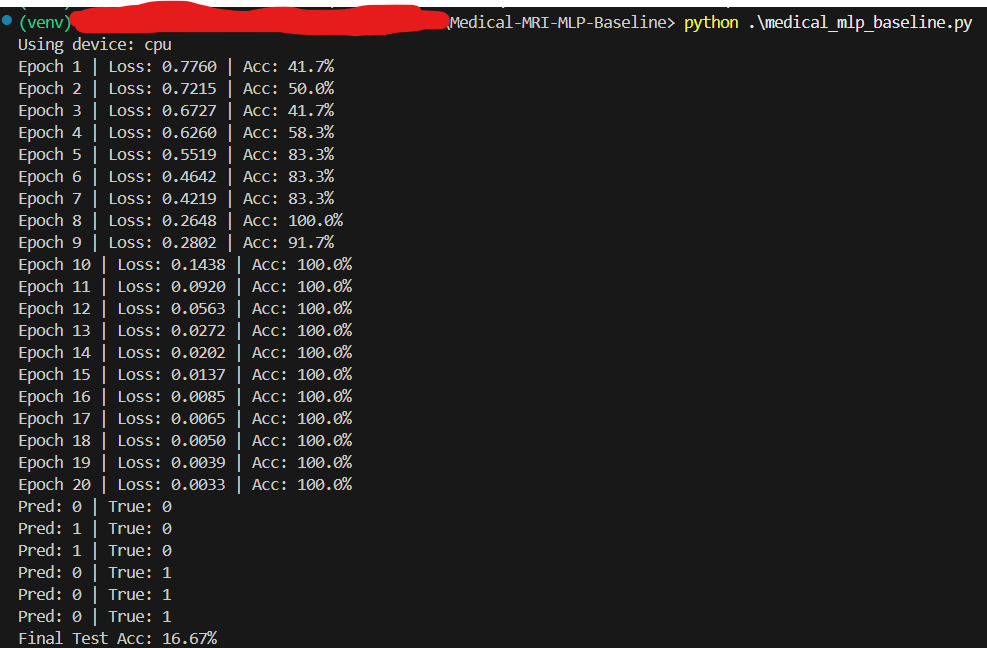

# 3D MRI Classification: Generalization Gap Analysis with MLPs

## Project Overview
This repository implements a deep learning pipeline designed to ingest, preprocess, and classify high-dimensional **3D NIFTI MRI scans** for Alzheimer's Disease detection.

The primary objective of this project was to establish a **performance baseline** for non-convolutional architectures on volumetric data. The study empirically demonstrates the "curse of dimensionality" and quantifies the severe generalization gap when applying dense architectures (MLPs) to complex spatial data with limited samples.

## Technical Architecture

### 1. Data Processing Pipeline
* **Input:** 3D Volumetric MRI Data (NIFTI .nii format).
* **Preprocessing:**
    * **Slice Extraction:** Automated extraction of the mid-axial slice to project 3D volume into 2D space.
    * **Normalization:** Voxel intensity scaling to standard [0, 1] range.
    * **Resizing:** Bilinear interpolation to 64x64 resolution.
* **Vectorization:** Flattening of spatial data into a 4,096 feature vector.

### 2. Model Configuration
* **Type:** Multi-Layer Perceptron (MLP)
* **Architecture:** Input(4096) -> Dense(128) -> ReLU -> Dense(64) -> ReLU -> Output(2)
* **Optimization:** Adam Optimizer (lr=0.001) with CrossEntropyLoss.

## Experimental Results
The experiment was conducted on a constrained subset of the **ADNI** dataset (18 subjects) to model data-scarce medical environments.

| Metric | Outcome | Analysis |
| :--- | :--- | :--- |
| **Training Accuracy** | **100.0%** | The model successfully memorized the decision boundaries of the training set by Epoch 5. |
| **Test Accuracy** | **16.67%** | The model failed to generalize to unseen patients, performing worse than random guessing (50%). |

### Key Findings
* **Generalization Gap:** The extreme divergence between training and test metrics confirms that simple MLPs lack the inductive bias (spatial invariance) required for MRI analysis.
* **Conclusion:** This baseline proves the necessity for **Convolutional Neural Networks (3D-CNNs)** or **Vision Transformers (ViTs)** to capture voxel-level correlations that are lost during the flattening process.

## Dataset Availability
This project utilizes a subset of the **ADNI (Alzheimer's Disease Neuroimaging Initiative)** dataset.

**Note:** Due to repository size limits and data privacy restrictions associated with medical records, the raw NIFTI (.nii) files are **not included** in this repository. To reproduce these results, please obtain access via [ADNI](http://adni.loni.usc.edu/).

## Usage

### 1. Requirements
```bash
pip install -r requirements.txt

## Execution Log
